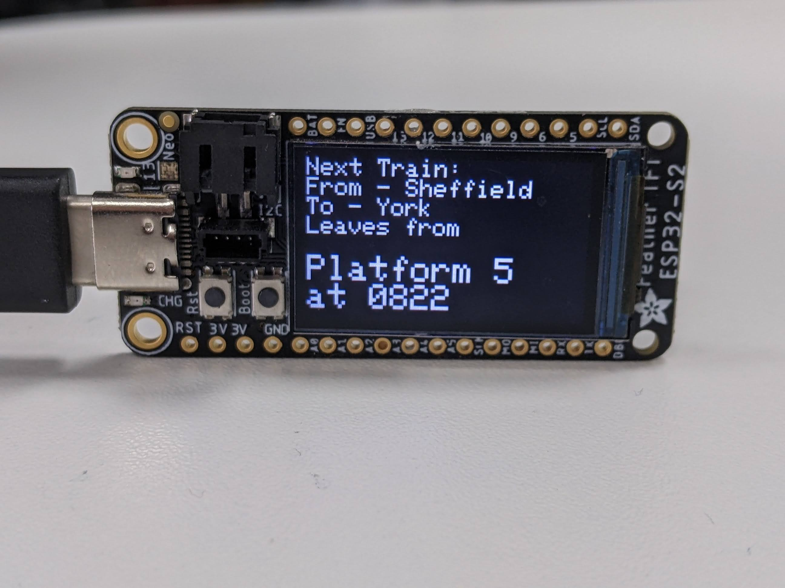

# TrainAlert
Firmware for ESP32 device that tells me when my next available train is leaving so I can leave the office on time. Can be configured using Telegram (For example to change the arrival and departure station, to get a notification of when the next train is via your phone).

## Acknowledgements
The data used for this project comes from Realtime Trains (https://api.rtt.io), which is very simple to use. 

